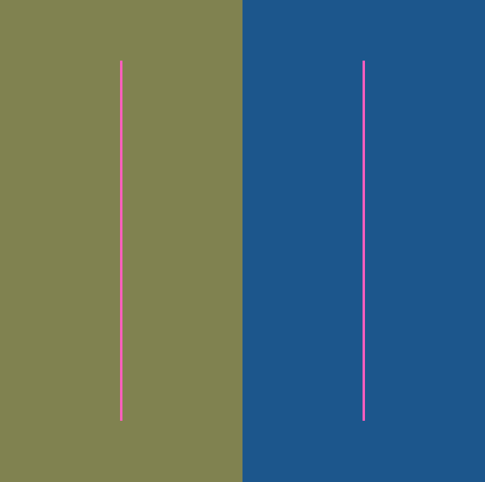
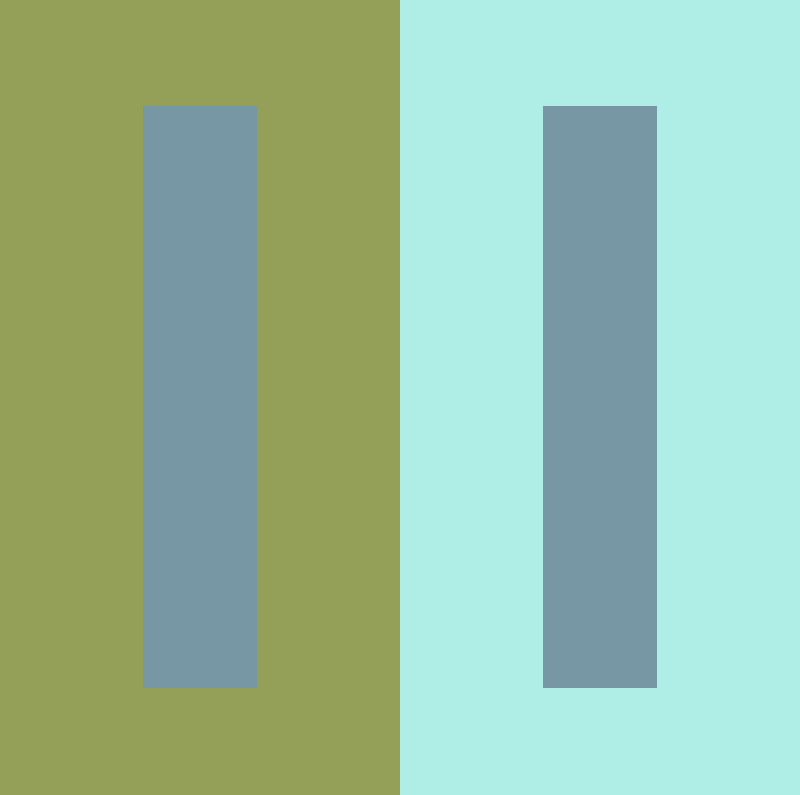

# Interaction of Color Explorer

A tool inspired by _Interaction of Color_ by Albers

The colors of the center rectangles are identical. The GUI allows you to set the colors of the left, right, and center rectangles as well changing the size. You can also start an animation of the hue of the middle rectangles.

Keys:
- g - show GUI
- s - take screenshot
- space - start/stop recording

Required addons:
- ofxGUI
- [ofxFFmpegRecorder](https://github.com/Furkanzmc/ofxFFmpegRecorder)
- ofxPoco

