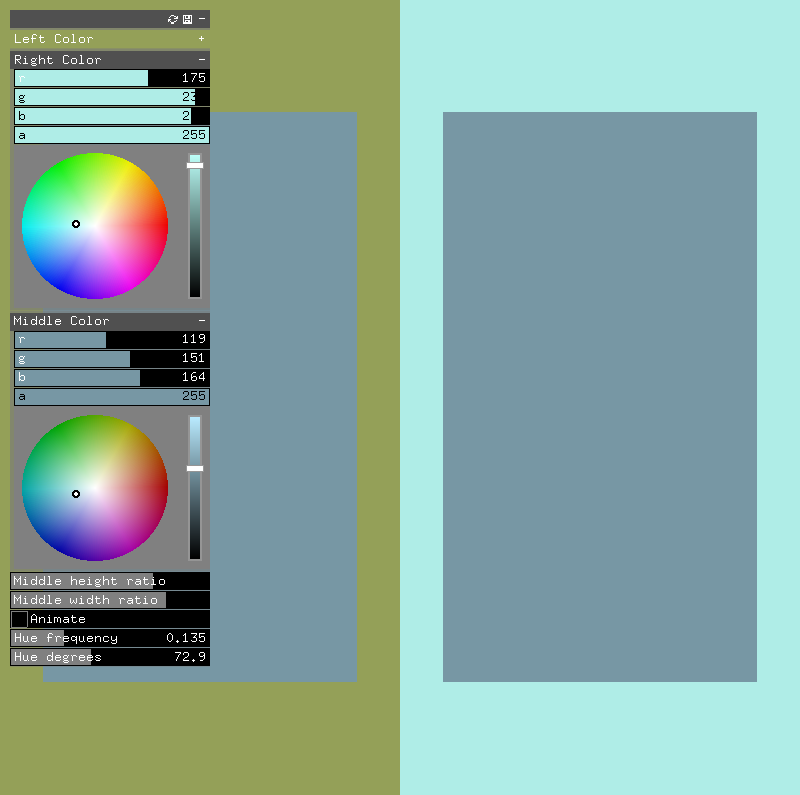

# Interaction of Color Explorer

A tool inspired by _Interaction of Color_ by Albers

Keys:
- g - show GUI
- s - take screenshot
- space - start/stop recording

Required addons:
- ofxGUI
- [ofxFFmpegRecorder](https://github.com/Furkanzmc/ofxFFmpegRecorder)
- ofxPoco

