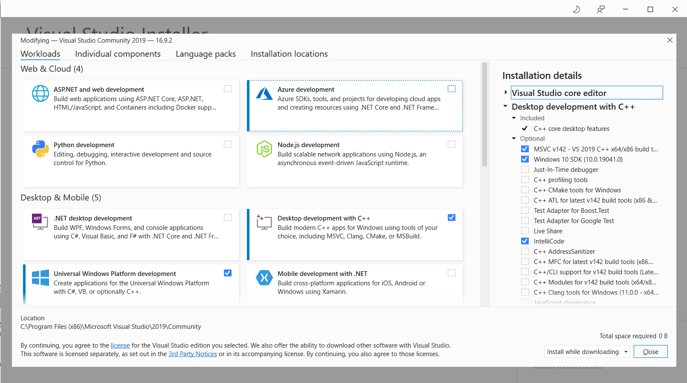
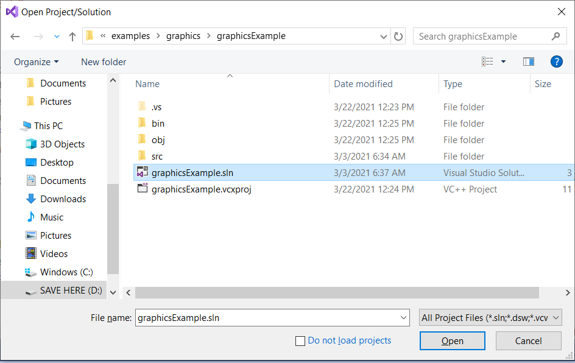
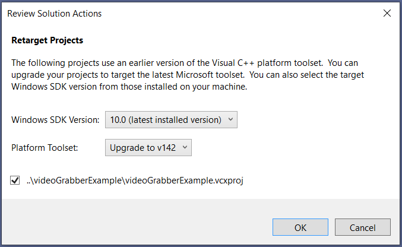
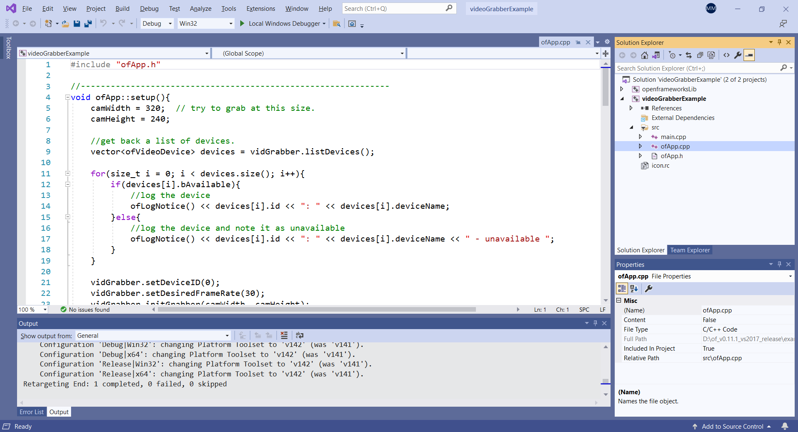
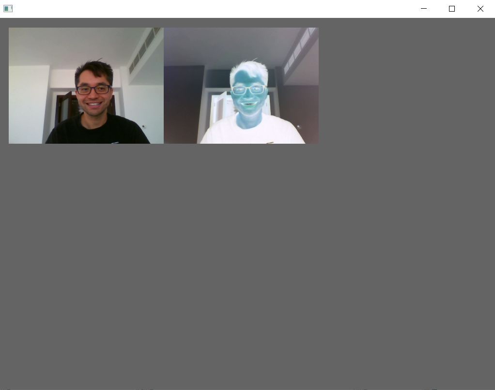

# Installing openFrameworks on Visual Studio 2019 for Windows

openFrameworks works with the latest version of Visual Studio (2019 version, as of this writing) but is not fully supported. The Solution/Project files from Visual Studio 2017 need to be automatically retargeted/updated to work with 2019.

[Download Visual Studio 2019 Community edition](https://visualstudio.microsoft.com/vs/community/)

Run the installer and make sure that "Universal Platform Development" and "Desktop Development with C++" are selected. These can also be added to an existing installation of VS from the Tools->Get Tools and Features menu.

[Download openFrameworks for Visual Studio 2017](https://openframeworks.cc/download/)
* Unzip this file
* The ``of..`` directory is your openFrameworks installation/root directory. Let's call this directory OF_ROOT

Build your first example:
* Open Visual Studio
* Do File->Open->Project/Solution and open the solution file ``OF_ROOT/examples/graphics/graphicsExample/graphicsExample.sln``

* You should be prompted to retarget/update the solution file (from VS 2017 format to VS 2019)

* Navigate to ``graphicsExample->src->ofApp.cpp`` to view the source code

* Click the play icon in the top toolbar to run/debug the project
* You should see some output in the Output window at the bottom and eventually the app will run!

* Click the close window button or hit ESC to exit the app
  * You can follow the directions in the command window to automatically close the command window after exiting the app

Run video examples:
* To run the video examples you need to install the video codecs
* Install the [K-Lite codecs](https://ninite.com/klitecodecs/)
* You should now be able to build and run ``OF_ROOT/examples/video/videoGrabberExample`` and see the captured video

Creating / updating a project file:
* You can use the openFrameworks project generator to create/update a project/solution file for Visual Studio 2017
* You will have to retarget the solution file for Visual Studio 2019 as above
